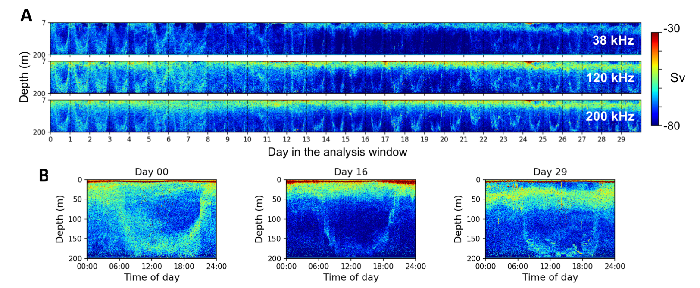
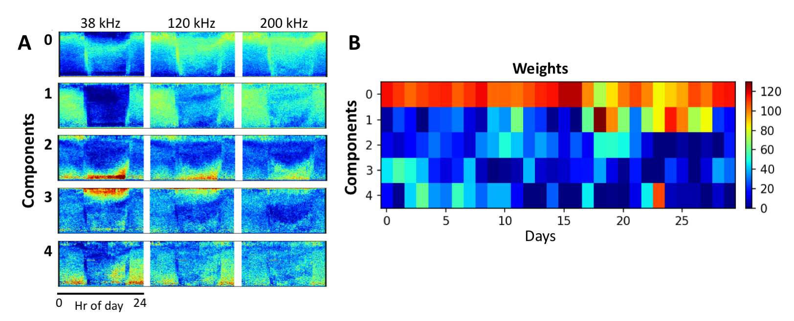

# Discovering patterns of marine organism activities using sonar time series from ocean observatories 

### [Wu-Jung Lee](mailto:wjlee@apl.washington.edu), [Valentina Staneva](mailto:vms16@uw.edu), [Bernease Herman](mailto:bernease@uw.edu), and [Aleksandr Aravkin](mailto:saravkin@uw.edu)
Applied Physics Laboratory, eScience Institute, and Department of Applied Mathematics, University of Washington

## Background
Recent advances in technology have produced a deluge of data that offer opportunities to study ecological processes at scales that are not possible previously. The Ocean Observatories Initiatives (OOI [1]) has installed a full fleet of upward-looking echosounders at diverse locations, from coastal water to deep ocean. By ensonifying the water column at a wide range of frequencies, these sonar systems deliver a continuous stream of echo data that encodes activity patterns of marine organisms across a large temporal scale. However, we currently lack methods to integrate and extract information from these large and complex data sets, many of which are collected in unfamiliar ecosystems with scarce biological ground truth. In fact, this requires a reverse process compared to most existing echo processing routines, which rely heavily on subjective, local, and empirical expert knowledge geared toward much smaller datasets from individual surveys.

**Figure 1.** (**A**) An exemplary echogram showing the variation volume backscattering strength (Sv) across a 30-day time window starting from August 10, 2015 at three sonar frequencies. (**B**) Three exemplary daily echograms collected at 120 kHz showing the spatiotemporal variation of marine organism activities.

## Approach and Preliminary Results
In this study, we explored the use of machine learning methods in discovering patterns of marine organism activities encoded in the sonar time series from ocean observatories. The analysis focused on the echosounder data collected from a cabled node in the Endurance Array off the coast of Oregon, which became operational in August 2015. This location was selected to facilitate direct comparison between outputs of our methodology and conventional analysis routines that have been specifically developed for this region. Using non-negative matrix factorization (NMF [2]), we show that the daily echograms (i.e., sonar images constructed using echo returns; Fig. 1) can be decomposed into an additive, weighted combination of multiple components. Importantly, through the NMF transformation, the day-to-day variation of echograms can be quantitatively summarized through the temporal variation of component weights in a significantly reduced dimensional space than the original data (Fig. 2). In addition, each of the components exhibits frequency-dependent characteristics, which can be used to infer biological assemblages. For example, component 0 in Fig. 2A captures the diel vertical migration of zooplankton. The components and the weights thus provide a starting point for inferring patterns of marine organism activities in a time-dependent manner. Alternate dimensionality reduction techniques which do not enforce additive contribution of the individual components (such as Principal Component Analysis) failed to extract well-distinguishable components. 

**Figure 2.** (**A**) Components result from applying non-negative matrix factorization (NMF) to the daily echograms shown in Fig. 1A. Each component exhibits frequency-dependent characteristics that can be used to infer biological composition. (**B**) Variation of component weights in the reduced dimensional space under NMF decomposition.

## Vision
As the NMF decomposition possesses a generative model formulation, it allows easy incorporation of additional constraints when specialized knowledge about the data is available, thus providing a fully flexible framework for data assimilation. By refining the optimization criteria within NMF, covariate structures between sonar observations and other sources of data, such as physical or chemical oceanographic variables measured from the same node, can also be explored. Application of such methods to long-term echosounder observations across a network of nodes will enable analysis of marine organism activities across multiple temporal and spatial scales in response to the changing climate. [Work supported by the APL postdoctoral fellowship and the eScience Institute Winter Incubator Program.]

### References
1. The Ocean Observatories Initiative. [http://oceanobservatories.org](http://oceanobservatories.org). 
2. D. D. Lee, H. S. Seung, Learning the parts of objects by non-negative matrix factorization. Nature. 401, 788–91 (1999).
