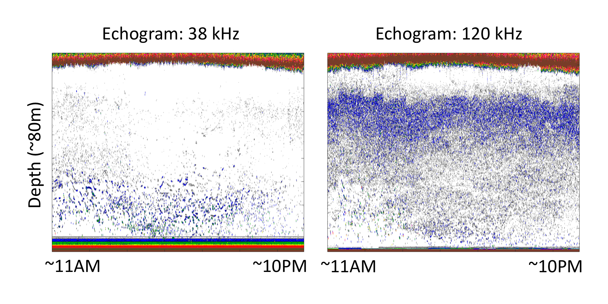
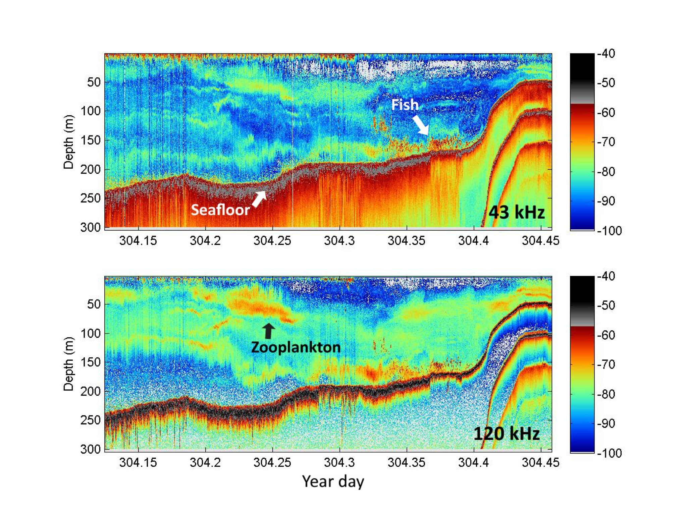

# OOI Sonar for Ecosystem Monitoring
[Link](https://github.com/uwescience/incubator2017/wiki/OOI-Sonar-for-Ecosystem-Monitoring) to project charter

## Data sources
* Contact point: Friedrich Knuth (knuth@marine.rutgers.edu)
* Official OOI data help: help@oceanobservatories.org

The sonar data files are current only accessible from the [OOI Raw Data Archive](http://oceanobservatories.org/data/raw-data/) and _not_ on the [OOI Data Portal](http://oceanobservatories.org/data-portal/). Individual instruments are indexed using the Reference Designator instrument code shown below:

| Type | Instrument | Depth | Array |
|:----:|:---------------------------:|:-----:|:-----:|
|Kongsberg EK60|CE02SHBP-MJ01C-07-ZPLSCB101	|80m	| Coastal Endurance|
|Kongsberg EK60|CE04OSPS-PC01B-05-ZPLSCB102	|200m| Coastal Endurance|
|ASL coastal|CE01ISSM-MFD37-07-ZPLSCC000	|25m		|Coastal Endurance|
|ASL coastal|CE06ISSM-MFD37-07-ZPLSCC000	|29m		|Coastal Endurance|
|ASL coastal|CE07SHSM-MFD37-07-ZPLSCC000	|87m		|Coastal Endurance|
|ASL coastal|CE09OSSM-MFD37-07-ZPLSCC000	|540m	|Coastal Endurance|
|ASL coastal|CP01CNSM-MFD37-07-ZPLSCC000	|133m	|Coastal Pioneer|
|ASL coastal|CP03ISSM-MFD37-07-ZPLSCC000	|92m		|Coastal Pioneer|
|ASL coastal|CP04OSSM-MFD37-07-ZPLSCC000	|450m	|Coastal Pioneer|
|ASL Global|GA02HYPM-MPM01-02-ZPLSGA009	|150m	|Global Argentine Basin|
|ASL Global|GA02HYPM-MPM01-02-ZPLSGA010	|150m	|Global Argentine Basin|
|ASL Global|GI02HYPM-MPM01-02-ZPLSGA009	|150m	|Global Irminger Sea|
|ASL Global|GI02HYPM-MPM01-02-ZPLSGA010	|150m	|Global Irminger Sea|
|ASL Global|GP02HYPM-MPM01-02-ZPLSGA009	|150m	|Global Station Papa|
|ASL Global|GP02HYPM-MPM01-02-ZPLSGA010	|150m	|Global Station Papa|
|ASL Global|GS02HYPM-MPM01-02-ZPLSGA009	|150m	|Global Southern Ocean|
|ASL Global|GS02HYPM-MPM01-02-ZPLSGA010	|150m	|Global Southern Ocean|

Additional information about the instruments can be found at these locations by searching for the "zpls" instrument code. The data management team at Rutgers are working on centralizing these resources.

Below are a few related websites:

* [OOI Main Website](http://oceanobservatories.org/instruments/)
* [Data Portal Asset Management Page](https://ooinet.oceanobservatories.org/assets/management/)
* [Data Team QA/QC Testing Database](https://ooi.visualocean.net/instruments/all)
* National Center for Environmental Information (NCEI) - [Water column sonar data](Link to the sonar data repository http://www.ngdc.noaa.gov/mgg/wcd/)

## Data type and features
In this project we will focus on the sonar echo data collected using modified Kongberg Simrad EK60 echosounders (those with instrument code ZPLSC-**B**). The files are typically 50 MB in size, each containing ~11 hours of echo data. The data are in _.raw_ format, which is a compressed data format from the manufacturer. We currently have a Matlab and [a Python package](https://github.com/oceanobservatories/mi-instrument/tree/master/mi/instrument/kut/ek60/ooicore) that can unpack the data and plot an echogram (see below).

The data are echo time series of multiple sonar _pings_ transmitted roughly every second. For each ping, the returning echoes form a time series, which can be converted to _depth_ by calculating the two-way travel time of sound from any particular point in the water colume to the sonar transducer. By plotting the returning echo time series across pings, we arrive at the _echograms_ as shown below.

Similar data are routinely collected using ship-mounted echosounders on all research vessels from NOAA and other agencies. Below is an example.

Note the two freuqencies of data were collected nearly simultaneously.

## Other resources
* [Ocean Network Canada](www.oceannetworks.ca/)'s wiki page about their data product [ASL Acoustic Profiler Time Series](https://wiki.oceannetworks.ca/display/DP/24). The ASL echosounders are also used on un-cabled OOI nodes.

